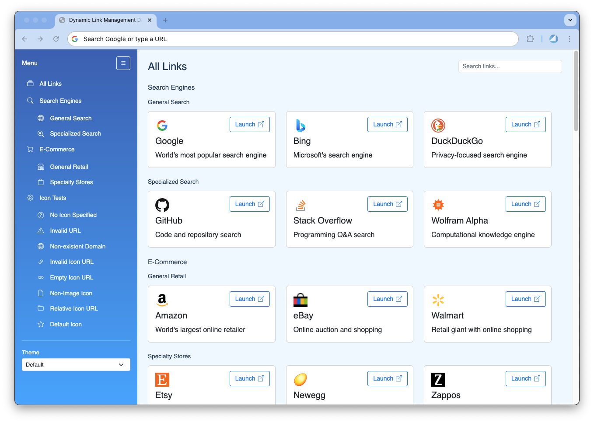
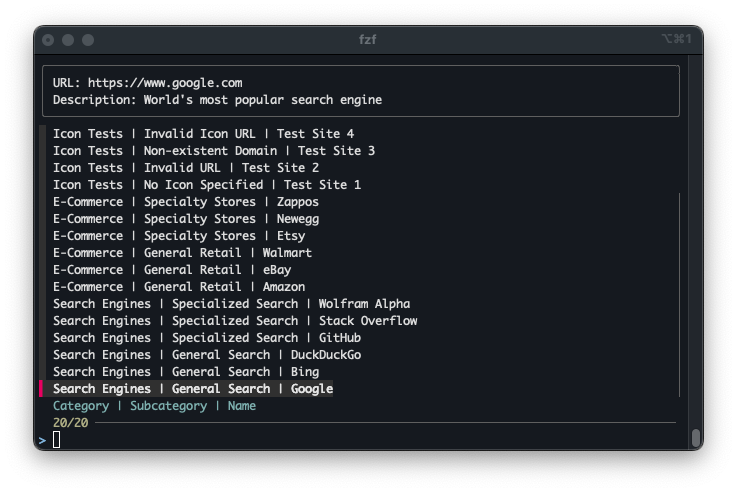

# Link Manager

A simple, elegant link management application that helps you organize and access your favorite links quickly.

## Features

- **Category Organization**: Organize links into categories and subcategories
- **Quick Search**: Instantly find links with the search functionality
- **Responsive Design**: Works on all screen sizes
- **Theme Support**: Multiple themes available, including a space-efficient compact theme
- **Collapsible Sidebar**: Save space by collapsing the navigation panel
- **Icon Support**: Custom icons for categories, subcategories, and links
- **Bookmark Import**: Import your browser bookmarks with automatic favicon detection
- **Command Line Interface**: Quick access to links via fuzzy search (see [Scripts](scripts/README.md))

## Usage

1. Open `index.html` in your web browser
2. Navigate through categories using the sidebar
3. Use the search box to find specific links
4. Click the launch button to open links
5. Toggle the sidebar using the collapse button
6. Change themes using the theme selector



## Themes

The application comes with multiple themes:

- **Default Theme**: Clean, modern design with spacious layout
- **Chrome Theme**: Google Chrome-inspired design with Material Design elements
- **Brutal Theme**: Bold brutalism design with sharp edges and raw elements
- **Retro Theme**: Nostalgic retro computing theme
- **Star Wars Theme**: Theme inspired by the Star Wars universe
- **Star Wars Light**: Light Side theme inspired by the Jedi Order with green accents
- **Star Wars Dark**: Dark Side theme inspired by the Sith Order with red accents
- **Star Trek Theme**: Theme inspired by the Star Trek universe
- **High Contrast**: Enhanced accessibility
- **Compact Themes**: Various compact layouts optimized for efficiency:
  - **Compact Horizontal**: Space-efficient layout optimized for smaller screens
  - **Compact Modern**: Clean and efficient layout with Inter font
  - **Compact Warm**: Cozy and efficient layout with Plus Jakarta Sans font
  - **Compact Cool**: Fresh and efficient layout with Outfit font
  - **Compact Dark**: Sleek and efficient dark layout with DM Sans font
  - **Compact Ultra**: Ultra-compact layout with Space Grotesk font

### Compact Theme Features

- Full-width responsive rows
- Dynamic text scaling
- Space-efficient layout
- Optimized for smaller screens
- Single-line descriptions on mobile

## Customization

### Adding Links

Edit the `js/links.js` file to add or modify links:

```javascript
const links = [
  {
    name: "Link Title",
    url: "https://example.com",
    description: "Link description",
    category: "Category Name",
    subcategory: "Subcategory Name",
    icon: "https://example.com/icon.png" // Optional custom icon
  }
];
```

### Modifying Categories

Edit the `js/categories.js` file to modify categories:

```javascript
const categories = [
  {
    name: "Category Name",
    icon: "bi-folder", // Bootstrap icon class
    subcategories: [
      {
        name: "Subcategory 1",
        icon: "bi-folder2" // Bootstrap icon class
      }
    ]
  }
];
```

### Icon Support

The application supports multiple types of icons:

1. **Category/Subcategory Icons**:
   - Use Bootstrap Icons (e.g., `bi-folder`, `bi-search`)
   - Default icons are provided if none specified
   - Custom icons can be added via CSS

2. **Link Icons**:
   - Custom icon URLs
   - Automatic favicon detection
   - Fallback to default icon
   - Support for various icon sizes

### Adding Themes

1. Create a new CSS file in the `themes` directory
2. Follow the theme specification in `THEME_SPECIFICATION.md`
3. Add the theme to the theme selector in `index.html`

## Importing Bookmarks

Use the bookmark converter to import your browser bookmarks:

```bash
python utility_scripts/bookmark_converter.py path/to/bookmarks.html --output-dir path/to/output
```

The converter will:

- Preserve your category structure
- Automatically detect favicons
- Generate appropriate icon URLs
- Create the required JavaScript files

## Command Line Interface

The application includes a command-line interface for quick access to your links:

```bash
python3 scripts/link_search.py
```

This provides a fuzzy-search interface using `fzf`, allowing you to quickly find and open links from your terminal. For more details, see the [Scripts documentation](scripts/README.md).



## Browser Support

- Modern browsers with ES6 JavaScript support
- CSS Grid and Flexbox support
- Local Storage API support

## License

MIT License - Feel free to use and modify for your needs.